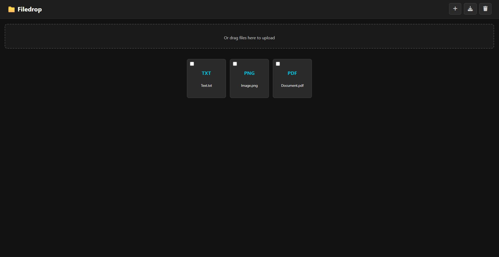

# Filedrop

A lightweight, self-hosted file-sharing server built with Python and Flask. Designed for private file transfers between your own devices.

## Features
- Uploading multiple files
- Downloading multiple/all files from
- Deleting multiple/all files

## Installation
```bash
git clone https://github.com/Jannissss/filedrop.git
cd filedrop
python3 -m venv venv
source venv/bin/activate
pip install -r requirements.txt
```
To run the server manually:
```bash
python3 server.py
```
For running the server as a daemon, consider creating a systemd service file:
```
# NOTE:
# Replace all instances of /path/to/filedrop/ with the full path to your cloned filedrop directory.
# Example: /home/ubuntu/filedrop/

[Unit]
Description=Python-based filedrop web server
After=network.target auditd.service

[Service]
WorkingDirectory=/path/to/filedrop
ExecStart=/path/to/filedrop/venv/bin/python3 /path/to/filedrop/server.py
Restart=always

[Install]
WantedBy=multi-user.target
```
To create, enable and run it:
```bash
sudo nano /etc/systemd/system/filedrop.service
# Place the systemd service file content from above into that file
sudo systemctl daemon-reload
sudo systemctl enable filedrop.service
sudo systemctl restart filedrop.service
```
Check if it is running:
```bash
sudo systemctl status filedrop.service
```

## Usage
By default, the server listens on `http://0.0.0.0:9094`, making it accessible from any browser on your network.
### Uploading
To upload files, click the "+" button in the top-right corner of the page, or drag and drop them into the upload area at the top. Once the images are uploaded, they are saved in the `/uploads` folder of the cloned directory and can be accessed by anyone with access to the webpage.
### Downloading
For downloading you have multiple options. The simplest is to just click on a file. Another one is to select multiple files by checking the checkbox in the top-left corner of each file. After selecting one or more files, click the download button in the top-right corner to download them as a .zip archive. If no files are selected, clicking the download button will download all files as a .zip archive.
### Deleting
To delete a file, select it using the checkbox and click the trash icon in the top-right corner. If no files are selected, clicking the trash icon will delete all files . Deleting files will also delete them from the `/uploads` folder on the server.

## Security
Currently, all uploaded files are publicly accessible to anyone who can access the server's webpage. This means any user with network access to the server can view, download, or delete files without authentication.
Please avoid uploading sensitive or private files unless your server is properly secured and access is restricted.
Session-based access control is planned for an upcoming release to improve privacy and user management.

## Planned Features
- Session-based access control
- Automatic file cleanup
- Improved UI

## Preview Images

